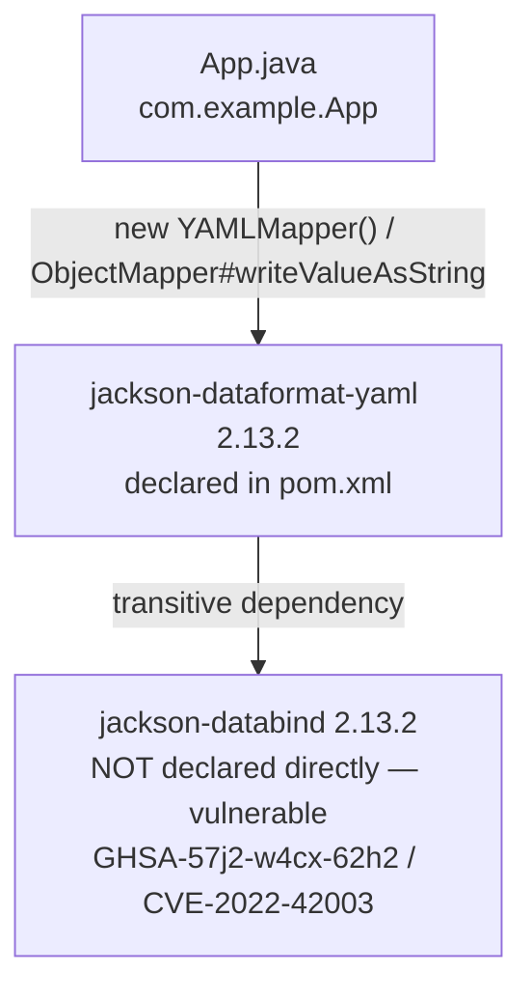

`pom.xml` declares only `jackson-dataformat-yaml:2.13.2` (plus a test-scoped
`junit-jupiter`); it pulls `jackson-databind:2.13.2` in transitively.
`App.java` imports `com.fasterxml.jackson.databind.ObjectMapper` directly and
instantiates `YAMLMapper` (an `ObjectMapper` subclass), so the vulnerable
class is on the real compile + runtime path, not just present in the
dependency tree unused.
