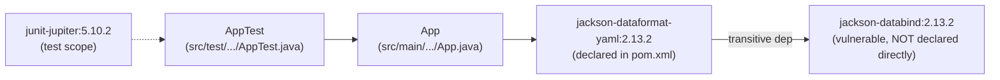

There is only one Maven module (`com.appfire.resolver:teamboard-java`), one production class (`App`), and one test class (`AppTest`). `App` calls `new YAMLMapper()` (from `jackson-dataformat-yaml`) whose `ObjectMapper` superclass is provided by `jackson-databind` — that's the only edge that matters for this fixture: it's what makes the vulnerable version reachable at compile and runtime instead of being an unused transitive artifact.
