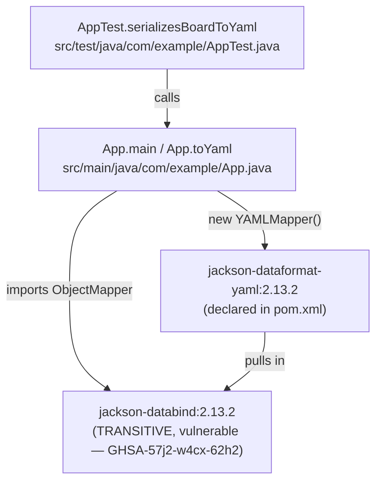

Single-module Maven build, no services, no network, no persistence. The only
non-trivial edge is the transitive dependency pull shown below.

`App` imports `ObjectMapper` from `jackson-databind` directly even though the
POM never declares that artifact — that import is what keeps the vulnerable
transitive dependency on the real compile/runtime path (see
[[dependency-fix-invariant]]).
