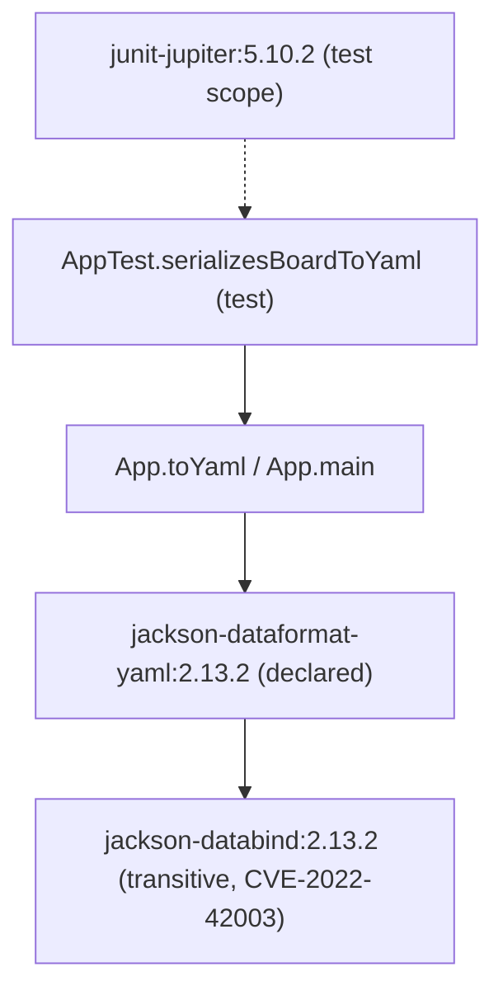

There is no multi-service architecture here — just one Maven module. The
graph below is the dependency + call shape that matters for the fixture.

Build: `maven-compiler-plugin:3.13.0` (release 17) +
`maven-surefire-plugin:3.2.5` run the JUnit 5 (`junit.version=5.10.2`) tests.
No other plugins, no lockfile — Maven resolves `jackson-databind`'s version
purely from `jackson-dataformat-yaml`'s own POM, which is why a
`<dependencyManagement>` pin (not a `<dependencies>` edit) is the only way to
override it. See [[overview]] and [[dependency-fix-conventions]].
