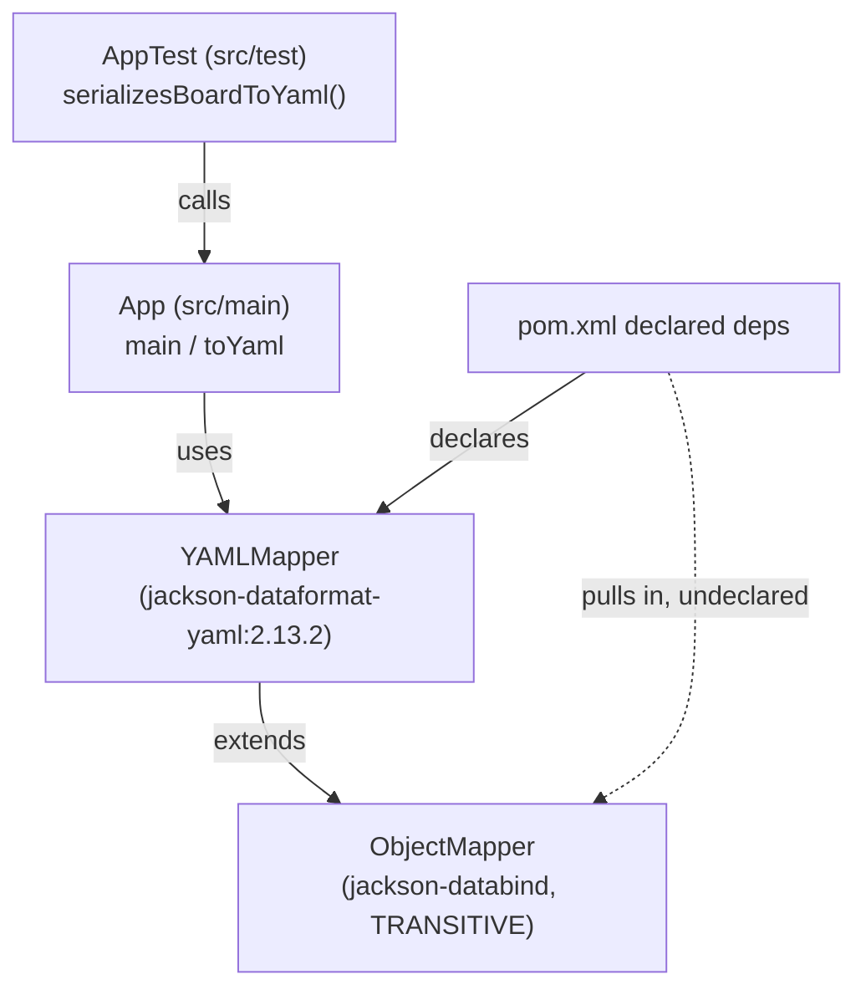

Single Maven module, one production class, one test class. No services, no
network calls, no database.

- `App.toYaml` builds a `YAMLMapper` (which extends Jackson's `ObjectMapper`)
  and calls `writeValueAsString`, so both `jackson-dataformat-yaml` and the
  transitively-pulled `jackson-databind` are exercised on a real code path —
  not just declared in `pom.xml`.
- `pom.xml` declares only `jackson-dataformat-yaml:2.13.2` and (test-scope)
  `junit-jupiter`; `jackson-databind` is never declared directly, which is the
  whole point of the fixture — see [[dependency-fix-invariant]].
- `AppTest` is the only caller of `App` in the repo.
